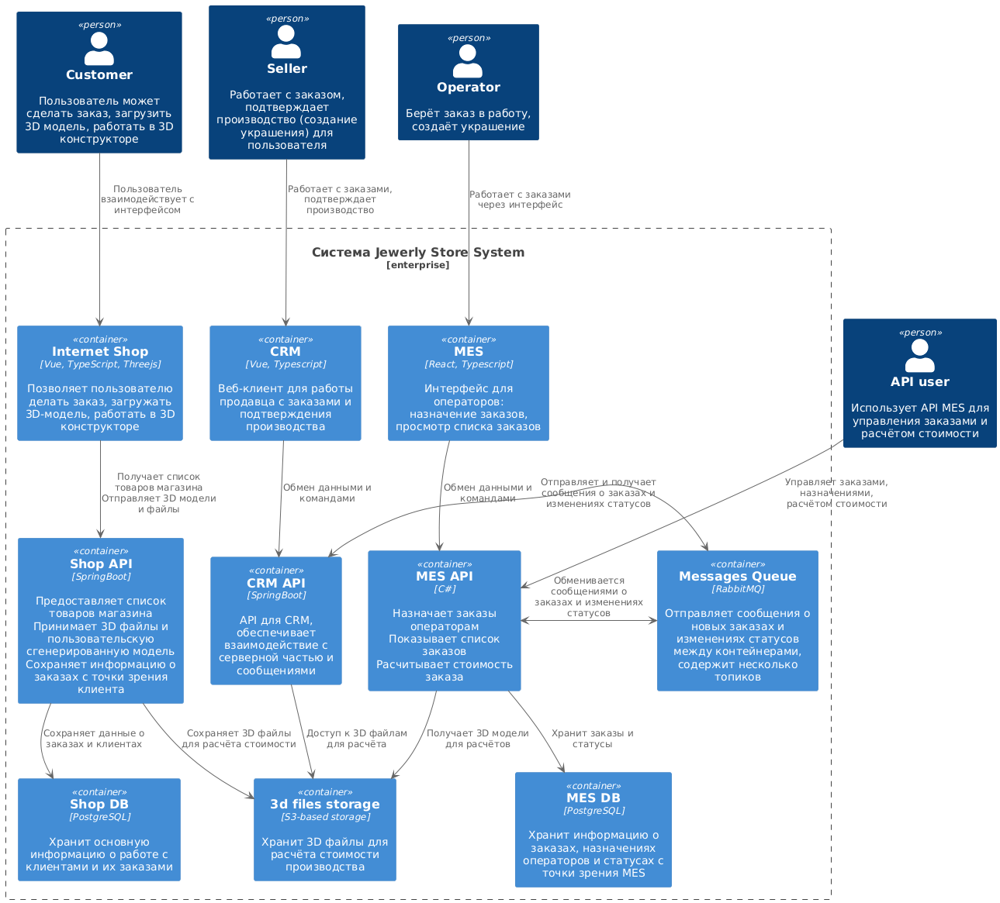

# I. Анализ и Идентификация Проблем

Диаграмма контейнеров «Александрит» (русифицированная):  

  
  
[diagram_puml_ru.puml](diagrams/diagram_puml_ru.puml)  

На основе предоставленной информации, можно выделить следующие проблемы:

- **Медленный расчет стоимости в MES:**  
  - Проблема: Расчет занимает 2-3 минуты в среднем, но может достигать 30 минут для сложных моделей. Это вызывает задержки в обработке заказов, особенно при возросшей нагрузке и использовании API.  
  - Последствия: Недовольство клиентов (просроченные заказы), потеря контрактов (недовольство пользователей API), блокировка операторов.  
  - Причины: Вероятно, неоптимизированный алгоритм расчета, недостаточная вычислительная мощность, узкое место в хранилище 3D-моделей.  

- **Проблемы с очередью сообщений (RabbitMQ):**  
  - Проблема: Потерянные заказы (клиенты не получают свои заказы, пользователи API не получают заказы). Это указывает на возможные проблемы с надежностью и масштабируемостью RabbitMQ, а также с логикой обработки сообщений.  
  - Последствия: Потеря данных, недовольство клиентов, потеря репутации.  
  - Причины: Перегрузка очереди, неправильная конфигурация, ошибки в коде обработки сообщений, недостаточная обработка ошибок.  

- **Медленная загрузка интерфейса MES (тормозит дашборд):**  
  - Проблема: Операторы не могут быстро получить доступ к новым заказам, что влияет на их мотивацию и эффективность. Фильтрация и пагинация не решили проблему.  
  - Последствия: Снижение производительности операторов, потеря мотивации, задержки в начале работы над заказами.  
  - Причины: Неоптимизированный запрос к базе данных, слишком много данных, отображаемых на дашборде, неэффективная работа с данными на стороне клиента (React).  

- **Ручной и медленный процесс развертывания (деплоя):**  
  - Проблема: Ручные деплои приводят к задержкам, особенно из-за ручного тестирования и блокировки релизами с багами.  
  - Последствия: Замедление доставки новых функций и исправлений, увеличение времени реагирования на проблемы.  
  - Причины: Отсутствие автоматизации тестирования, недостаточная интеграция между этапами разработки и развертывания.  

- **Монолитная Архитектура (один инстанс на приложение):**  
  - Проблема: Отсутствие масштабируемости и отказоустойчивости. Один инстанс на приложение означает, что любой сбой или перегрузка может привести к полной остановке сервиса.  
  - Последствия: Низкая надежность, проблемы с масштабированием при увеличении нагрузки.  
  - Причины: Изначальная архитектура on-premise, отсутствие необходимости в масштабировании на ранних этапах.  

- **Единая база данных на чтение и запись:**  
  - Проблема: Нагрузка на базу данных из разных приложений и операций (чтение/запись) может создавать узкое место, особенно при увеличении нагрузки.  
  - Последствия: Замедление работы приложений, проблемы с масштабированием.  
  - Причины: Упрощенная архитектура, отсутствие оптимизации для высокой нагрузки.  

- **Недостаточное тестирование:**  
  - Проблема: Ручное E2E-тестирование и блокировка релизами с багами высокого приоритета замедляют процесс разработки.  
  - Последствия: Частые релизы с багами, задержки релизов, недовольство клиентов.  
  - Причины: Недостаточная автоматизация тестирования, отсутствие интеграционных и unit-тестов.  

# II. Разработка Инициатив

Исходя из выявленных проблем, предлагаю следующие инициативы:

1. **Оптимизация расчета стоимости в MES:**  
  - Анализ и оптимизация алгоритма расчета.  
  - Профилирование кода для выявления узких мест.  
  - Использование более мощных вычислительных ресурсов (например, увеличение размера инстанса EC2 или использование GPU для расчетов).
  - Оптимизация формата 3D-моделей и процесса их загрузки.  
  - Кеширование результатов расчетов для часто используемых моделей.  

2. **Повышение надежности и масштабируемости RabbitMQ:**  
  - Анализ конфигурации RabbitMQ и ее оптимизация для текущей нагрузки.  
  - Внедрение мониторинга и алертинга для обнаружения проблем с очередью.  
    - Разделение очереди на несколько более мелких, специализированных очередей.  
    - Внедрение retry-механизмов для обработки ошибок при отправке и получении сообщений.  
    - Рассмотрение возможности использования более надежного и масштабируемого решения для обмена сообщениями (например, Kafka).  

3. **Оптимизация производительности дашборда MES:**  
    - Анализ запроса к базе данных, который используется для отображения заказов на дашборде.  
    - Оптимизация запроса (индексы, кэширование результатов).  
    - Перенос части логики обработки данных на серверную сторону (например, агрегация данных).  
    - Использование более эффективных компонентов React для отображения данных (например, виртуализация списков).  
    - Ограничение количества отображаемых заказов на дашборде и предоставление пользователям более гибких фильтров.  

4. **Автоматизация процесса развертывания (CI/CD):**  
    - Внедрение автоматических unit-тестов и интеграционных тестов.  
    - Автоматизация процесса сборки и развертывания приложений.  
    - Использование инструментов CI/CD (например, Jenkins, GitLab CI, GitHub Actions).  
    - Внедрение стратегии blue/green deployment для минимизации простоя при развертывании.  

5. **Микросервисная Архитектура:**  
    - Разделение монолитных приложений на микросервисы.  
    - Выделение отдельных сервисов для расчета стоимости, управления заказами и т.д.  
    - Использование API Gateway для управления маршрутизацией запросов к микросервисам.  
    - Контейнеризация микросервисов (Docker) и оркестрация (Kubernetes).  

6. **Разделение базы данных на чтение и запись (Read/Write Splitting):**  
    - Внедрение репликации базы данных.  
    - Направление запросов на чтение на реплики, а запросов на запись на мастер-сервер.  
    - Использование технологий для автоматического управления репликацией и маршрутизацией запросов.  

7. **Улучшение процессов тестирования:**  
    - Автоматизация E2E-тестов.  
    - Внедрение code review.  
    - Внедрение мониторинга и алертинга для быстрого обнаружения проблем на продакшене.  

# III. Приоритизация Инициатив

Приоритизация инициатив должна учитывать срочность решения проблемы, влияние на бизнес и трудозатраты. Предлагаю следующую приоритизацию:

1. **Оптимизация расчета стоимости в MES (Высокий приоритет):**  
   Это напрямую влияет на основную бизнес-функцию (обработка заказов) и является источником множества проблем.  
2. **Повышение надежности и масштабируемости RabbitMQ (Высокий приоритет):**  
   Потеря заказов – критическая проблема, требующая немедленного решения.  
3. **Оптимизация производительности дашборда MES (Средний приоритет):**  
   Улучшение опыта операторов повысит их продуктивность и мотивацию.  
4. **Автоматизация процесса развертывания (CI/CD) (Средний приоритет):**  
   Ускорение разработки и доставки новых функций и исправлений.  
5. **Микросервисная Архитектура (Низкий приоритет, долгосрочная перспектива):**  
   Это более сложная и долгосрочная задача, которая требует значительных инвестиций.  
6. **Разделение базы данных на чтение и запись (Read/Write Splitting) (Низкий приоритет, среднесрочная перспектива):**  
   Требуется, когда количество операций чтения/записи критически возрастет.  
7. **Улучшение процессов тестирования (Средний приоритет):**  
   ...

# IV. Целевая Архитектура через полгода

Через полгода я вижу следующую целевую архитектуру:

- **Оптимизированный расчет стоимости в MES:**  
  Время расчета значительно сокращено, что позволяет обрабатывать больше заказов и снизить недовольство клиентов.  
- **Стабильная и масштабируемая очередь сообщений (RabbitMQ):**  
  Потеря заказов минимизирована, система способна обрабатывать возросшую нагрузку.  
- **Быстрый и удобный дашборд MES:**  
  Операторы могут быстро получить доступ к новым заказам и эффективно выполнять свою работу.  
- **Автоматизированный процесс развертывания (CI/CD):**  
  Релизы происходят быстрее и надежнее, что позволяет оперативно реагировать на изменения и выпускать исправления.  
- **Начало миграции к микросервисной архитектуре:**  
  Выделен и развернут один или два небольших микросервиса.  

# V. Три пункта из списка инициатив на ближайшие полгода

Если бы у меня была возможность выполнить только три пункта из списка инициатив в ближайшие полгода, я бы выбрал следующие:

1. **Оптимизация расчета стоимости в MES:**  
   Это критично для обработки текущей нагрузки и снижения недовольства клиентов. Без этого все остальные улучшения не будут иметь большого эффекта.  
    - Конкретные шаги:  
        - Профилирование кода расчета стоимости.  
        - Оптимизация алгоритма и структур данных.  
        - Использование кэширования.  
        - Возможно, переход на более мощный инстанс EC2.  

2. **Повышение надежности и масштабируемости RabbitMQ:**  
   Потеря заказов недопустима, и это нужно решить как можно быстрее.  
    - Конкретные шаги:  
        - Анализ конфигурации RabbitMQ и ее оптимизация.  
        - Внедрение мониторинга и алертинга.  
        - Внедрение retry-механизмов.  

3. **Автоматизация процесса развертывания (CI/CD):**  
   Ускорение разработки и доставки новых функций и исправлений. Автоматизация тестирования.  
    - Конкретные шаги:  
        - Внедрение автоматических unit-тестов.  
        - Автоматизация процесса сборки и развертывания приложений.  
        - Использование инструментов CI/CD (например, Jenkins, GitLab CI, GitHub Actions).  

## Обоснование выбора:

Эти три инициативы направлены на решение самых критичных проблем (задержки и потеря заказов) и создают основу для дальнейшего развития и масштабирования системы.  
Они также относительно быстро реализуемы и могут принести ощутимые результаты в ближайшие месяцы.  
Микросервисная архитектура, разделение баз данных и улучшение процессов тестирования – важные задачи, но они требуют больше времени и инвестиций, и их реализация должна быть отложена на более поздний срок.  
