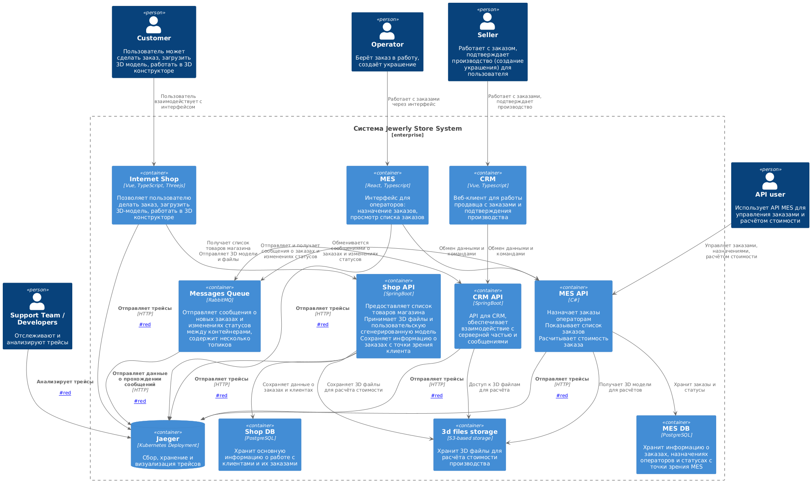
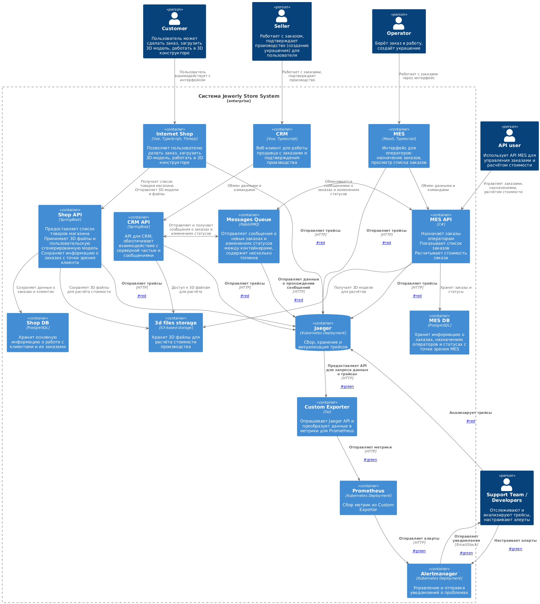

# Задание 3: Внедрение Трейсинга в "Александрит"  

## Мотивация  

Внедрение трейсинга в систему "Александрит" критически важно для повышения стабильности, надежности и прозрачности обработки заказов. Отсутствие детальной видимости в процесс прохождения заказа приводит к следующим проблемам:  

- **Сложность диагностики проблем:** Когда заказ "зависает" или теряется, сложно определить причину и ответственный компонент. Отсутствие трейсинга делает процесс отладки длительным и трудоемким.  
- **Снижение клиентской удовлетворенности:** Задержки в обработке заказов и отсутствие информации о статусе приводят к недовольству клиентов и потере контрактов.  
- **Увеличение нагрузки на поддержку:** Сотрудники поддержки тратят много времени на ручной поиск информации о заказах, что снижает их эффективность.  
- **Сложность оптимизации процессов:** Отсутствие данных о времени, затраченном на каждом этапе обработки заказа, не позволяет выявлять узкие места и оптимизировать процессы.  

Внедрение трейсинга позволит:  

- **Быстро локализовать и устранять проблемы:** Определять, на каком этапе произошла задержка или ошибка, и быстро восстанавливать работоспособность.  
- **Повысить прозрачность обработки заказов:** Предоставлять сотрудникам поддержки и клиентам актуальную информацию о статусе заказа на каждом этапе.  
- **Оптимизировать бизнес-процессы:** Выявлять узкие места и оптимизировать процессы, сокращая время обработки заказов и повышая эффективность.  
- **Улучшить качество обслуживания клиентов:** Предоставлять клиентам более быструю и качественную поддержку, повышая их удовлетворенность.  
- **Предотвратить потерю заказов:** Оперативно выявлять и устранять проблемы, приводящие к потере заказов.  

**Технические и бизнес-метрики:**  

1. **Среднее время разрешения инцидентов, связанных с задержками заказов:** Снижение времени, необходимого для выявления и устранения проблем с заказами.  
2. **Количество потерянных заказов в месяц:** Сокращение числа заказов, которые не доходят до клиента из-за технических проблем.  
3. **Среднее время обработки заказа (от SUBMITTED до SHIPPED):** Сокращение времени, необходимого для прохождения заказа по всем этапам.  
4. **Уровень удовлетворенности клиентов (NPS):** Увеличение лояльности клиентов и положительных отзывов.  
5. **Количество обращений в службу поддержки, связанных со статусом заказов:** Снижение нагрузки на службу поддержки за счет предоставления клиентам актуальной информации о статусе заказов.  

## Анализ системы и определение точек трейсинга  

На основе C4-диаграммы и описания системы, ключевые места для внедрения трейсинга:  

1. **Internet Shop:**  
   - **Прием заказа от пользователя (SUBMITTED).**  
   - **Загрузка 3D-модели (FILE_UPLOADED).**  
   - **Отправка запроса в Shop API.**  
   
2. **Shop API:**  
   - **Прием запроса на создание заказа.**  
   - **Сохранение информации о заказе в Shop DB.**  
   - **Отправка 3D файла в 3D Storage.**  
   - **Отправка сообщения в Message Queue о новом заказе.**  

3. **CRM API:**  
   - **Прием сообщения из Message Queue о новом заказе/изменении статуса.**  
   - **Обновление информации о заказе в CRM.**  
   - **Отправка запроса в MES API на расчет стоимости (если необходимо).**  

4. **MES API:**  
   - **Прием сообщения из Message Queue о новом заказе/изменении статуса.**  
   - **Получение 3D-модели из 3D Storage для расчета стоимости.**  
   - **Расчет стоимости заказа.**  
   - **Сохранение информации о стоимости в MES DB.**  
   - **Отправка сообщения в Message Queue о рассчитанной стоимости.**  
   - **Изменение статусов заказов (MANUFACTURING_STARTED, MANUFACTURING_COMPLETED, PACKAGING, SHIPPED).**  

5. **Message Queue (RabbitMQ):**  
   - **Мониторинг прохождения сообщений между сервисами.** Важно отслеживать потерю сообщений.  

6. **3D Storage:**  
   - **Отслеживание времени загрузки/выгрузки 3D-моделей.**  

### **Данные для трейсинга**  

Для каждого трейса необходимо собирать следующие данные:  

- **Trace ID:** Уникальный идентификатор для отслеживания всего пути заказа.  
- **Span ID:** Уникальный идентификатор для каждого этапа обработки заказа (например, сохранение заказа в Shop DB, расчет стоимости в MES).  
- **Parent Span ID:** Идентификатор родительского этапа, чтобы связать этапы в иерархию.  
- **Timestamp:** Время начала и окончания каждого этапа.  
- **Service Name:** Название сервиса, выполняющего этап (например, Shop API, MES API).  
- **Operation Name:** Название операции, выполняемой на этапе (например, "saveOrder", "calculatePrice").  
- **Tags:** Дополнительная информация о заказе, которая может быть полезна для отладки и анализа:  
  - **order_id:** ID заказа.  
  - **customer_id:** ID клиента.  
  - **status:** Текущий статус заказа.  
  - **3d_model_size:** Размер 3D-модели.  
  - **calculation_time:** Время, затраченное на расчет стоимости.  
  - **user_id:** ID пользователя (продавца, оператора), работающего с заказом.  
- **Logs:** Логи, связанные с этапом обработки заказа, содержащие полезную информацию об ошибках или предупреждениях.  

## Предлагаемое решение  

Для реализации трейсинга предлагается использовать следующий стек технологий:  

- **Jaeger:** Как система сбора, хранения и визуализации трейсов. Jaeger поддерживает OpenTracing и OpenTelemetry, что обеспечивает гибкость и возможность интеграции с различными языками и платформами.  
- **OpenTelemetry:** Стандарт для инструментирования приложений и сбора телеметрии (трейсы, метрики, логи). OpenTelemetry предоставляет SDK для различных языков (Java, C#, Python, JavaScript) и позволяет легко добавить трейсинг в существующие приложения.  
- **RabbitMQ Tracer Plugin:** Для отслеживания прохождения сообщений через RabbitMQ. Этот плагин позволит видеть, когда сообщение было отправлено, получено и обработано.  

**Компоненты, которые необходимо внедрить/доработать:**  

1. **OpenTelemetry SDK:** Интегрировать OpenTelemetry SDK в каждый сервис (Internet Shop, Shop API, CRM API, MES API). SDK будет отвечать за создание и отправку трейсов в Jaeger.  
2. **Jaeger Agent:** Развернуть Jaeger Agent на каждой ноде, где работают сервисы. Agent будет принимать трейсы от SDK и отправлять их в Jaeger Collector.  
3. **Jaeger Collector:** Развернуть Jaeger Collector для приема и обработки трейсов от Agents.  
4. **Jaeger Query:** Развернуть Jaeger Query для поиска и визуализации трейсов через веб-интерфейс.  
5. **RabbitMQ Tracer Plugin:** Установить и настроить плагин для RabbitMQ.  

**Новые связи на C4-диаграмме:**  

- **Каждый компонент (Internet Shop, Shop API, CRM API, MES API) -> Jaeger Agent:** Отправка трейсов.  
- **Jaeger Agent -> Jaeger Collector:** Отправка трейсов.  
- **Jaeger Collector -> Jaeger Query -> Администраторы/Поддержка:** Визуализация и анализ трейсов.  
- **RabbitMQ -> Jaeger Agent:** Отправка данных о прохождении сообщений.  

**Реализация трейсинга для каждого компонента:**  

- **Internet Shop (Vue/Java Spring Boot):** Использовать OpenTelemetry Java Agent для автоматического инструментирования Spring Boot приложения. Для Vue.js части можно использовать OpenTelemetry JavaScript SDK.  
- **Shop API (Java Spring Boot):** Использовать OpenTelemetry Java Agent для автоматического инструментирования Spring Boot приложения.  
- **CRM API (Java Spring Boot):** Использовать OpenTelemetry Java Agent для автоматического инструментирования Spring Boot приложения.  
- **MES API (C#):** Использовать OpenTelemetry .NET SDK для инструментирования C# приложения.  
- **MES (React/TypeScript):** Использовать OpenTelemetry JavaScript SDK для инструментирования React приложения.  
- **RabbitMQ:** Установить и настроить RabbitMQ Tracer Plugin для сбора данных о прохождении сообщений.  

**Схема системы с выделенными точками трейсинга:**  

  
  
[diagram_task3_puml_tracing.puml](diagrams/diagram_task3_puml_tracing.puml)  


## Компромиссы    

- **Производительность:** Внедрение трейсинга может незначительно повлиять на производительность системы из-за накладных расходов на создание и отправку трейсов. Важно правильно настроить OpenTelemetry SDK и Jaeger Agent, чтобы минимизировать это влияние (например, использовать sampling).  
- **Сложность внедрения:** Интеграция OpenTelemetry SDK в существующие приложения потребует времени и усилий.  
- **Стоимость:** Развертывание и поддержка Jaeger потребует дополнительных ресурсов (серверы, хранилище).  
- **Устаревший код:** Если в системе есть компоненты, написанные на устаревших языках или фреймворках, поддержка OpenTelemetry может быть ограничена или отсутствовать.  
- **3rd party системы:** Интеграция с 3rd party системами (например, платежные шлюзы) может быть сложной или невозможной, если они не поддерживают OpenTelemetry.  
- **3D Storage:** Так как это S3-совместимое хранилище, трейсинг операций с ним может быть реализован через middleware или обертки вокруг S3 клиента, однако, это может быть сложнее, чем внедрение в сервисы, написанные командой.  

## Аспекты безопасности  

- **Аутентификация и авторизация:** Доступ к Jaeger Query должен быть ограничен только для сотрудников компании с соответствующими правами (например, "Поддержка", "Разработчики"). Необходимо настроить аутентификацию и авторизацию для Jaeger Query.  
- **Шифрование:** Трейсы должны передаваться по защищенному каналу (HTTPS) между сервисами, Jaeger Agent и Jaeger Collector.  
- **Ограничение данных:** Не следует собирать конфиденциальную информацию (например, пароли, номера кредитных карт) в трейсах. Необходимо внимательно следить за тем, какие данные попадают в трейсы.  
- **Sampling:** Использовать sampling для уменьшения объема собираемых данных и снижения нагрузки на систему.  
- **Мониторинг:** Мониторить систему трейсинга (Jaeger) для выявления аномалий и угроз безопасности.  

## Дополнительное задание: Автоматический мониторинг и алертинг  

Для автоматического мониторинга процесса прохождения заказа и алертинга на основе данных трейсинга можно использовать следующие компоненты:  

1. **Jaeger API:** Jaeger предоставляет API для запроса данных о трейсах.  
2. **Prometheus:** Система мониторинга и алертинга.  
3. **Alertmanager:** Компонент Prometheus для управления и отправки уведомлений.  
4. **Custom Exporter:** Сервис, периодически опрашивающий Jaeger API и преобразующий полученные данные в метрики, понятные Prometheus.  

## Реализация:  

1. **Custom Exporter:** Разработать Custom Exporter, который будет:
   - Периодически запрашивать данные о трейсах заказов из Jaeger API.
   - Анализировать трейсы и извлекать ключевые метрики:
     - **Среднее время обработки заказа** на каждом этапе.
     - **Количество заказов в каждом статусе.**
     - **Количество заказов, которые "зависли"** на определенном этапе (например, превышают заданное время ожидания).
     - **Количество ошибок на каждом этапе.**
   - Преобразовывать извлеченные метрики в формат, понятный Prometheus.
   - Предоставлять метрики через HTTP endpoint, доступный для Prometheus.

2. **Prometheus:** Настроить Prometheus для сбора метрик с Custom Exporter.
   - Определить конфигурацию в `prometheus.yml`, чтобы включить Custom Exporter в качестве источника метрик.
   - Установить период опроса и другие параметры по необходимости.

3. **Alertmanager:** Настроить Alertmanager для отправки уведомлений при возникновении аномалий:
   - **Заказ "завис" на определенном этапе** (превышает заданное время ожидания).
   - **Увеличилось время обработки заказа** на определенном этапе.
   - **Увеличилось количество ошибок** на определенном этапе.
   - **Обнаружена потеря сообщений в RabbitMQ** (на основе данных, собранных RabbitMQ Tracer Plugin).
   - Определить правила алертинга в конфигурации Alertmanager, настроить каналы для уведомлений (например, Slack, Email).

**Новые связи на C4-диаграмме:**  

- **Jaeger API -> Custom Exporter:** Запрос данных о трейсах.  
- **Custom Exporter -> Prometheus:** Отправка метрик.  
- **Prometheus -> Alertmanager:** Отправка уведомлений.  
- **Alertmanager -> Сотрудники поддержки/Разработчики:** Получение уведомлений.  

**Схема системы с выделенными точками трейсинга, мониторингом и алертингом:**  

  
  
[diagram_task3_puml_tracing_monitoring_alerting.puml](diagrams/diagram_task3_puml_tracing_monitoring_alerting.puml)  


**Пример конфигурации Alertmanager:**

```yaml
receivers:
  - name: 'support_team'
    email_configs:
      - to: 'support@example.com'
      
route:
  receiver: 'support_team'
  group_wait: 30s
  group_interval: 5m
  repeat_interval: 1h
  routes:
    - match:
        alertname: OrderStuck
      group_wait: 10s

    - match:
        alertname: OrderProcessingTimeExceeded
      group_wait: 10s
```

## Заключение:

Внедрение предложенного решения для трейсинга позволит компании "Александрит" значительно улучшить видимость в процесс обработки заказов, быстро локализовать и устранять проблемы, оптимизировать бизнес-процессы и повысить качество обслуживания клиентов. Автоматический мониторинг и алертинг обеспечат оперативное реагирование на аномалии и предотвращение критических сбоев.
