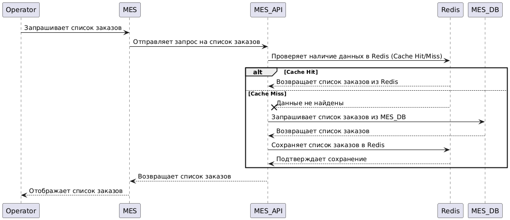
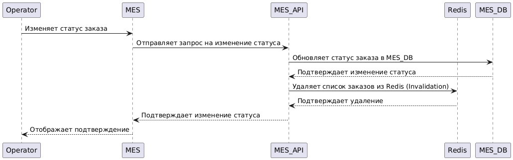
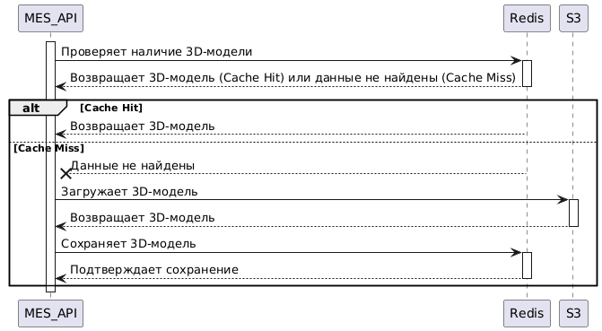
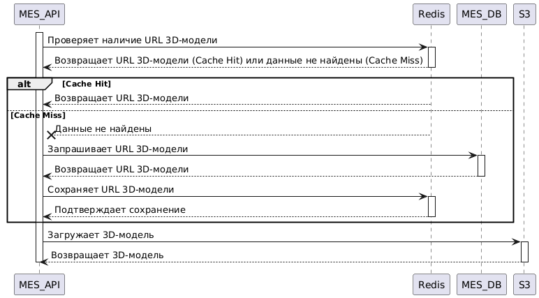

# Задание 5: Внедрение Кеширования в «Александрит»

## Мотивация  

В настоящее время система «Александрит» испытывает проблемы с производительностью, особенно при работе с заказами. Медленная загрузка дашборда в MES, жалобы пользователей API на задержки в расчете стоимости и общая медлительность системы указывают на необходимость внедрения кеширования.

Цель внедрения кеширования - ускорить доступ к часто используемым данным, снизить нагрузку на базы данных и повысить отзывчивость системы в целом.

Планируется включить в кеширование следующие элементы системы:

1. **Список заказов в MES:** Ускорение загрузки дашборда операторов в MES, что позволит им быстрее брать заказы в работу. Это напрямую влияет на их мотивацию и скорость обработки заказов.
   
2. **Данные о товарах в Internet Shop:** Ускорение загрузки страниц товаров и списков товаров в Internet Shop, что улучшит пользовательский опыт и увеличит конверсию.
   
3. **Результаты расчета стоимости в MES:** Ускорение ответов API для партнеров и пользователей, снижая задержки и улучшая интеграцию с внешними системами.
   
4. **3D-модели:** Уменьшение нагрузки на S3-хранилище и ускорение доступа к 3D-моделям при расчете стоимости и отображении в интерфейсах. (Рассмотрено как потенциальный вариант)

## Предлагаемое решение  

1. **Тип кеширования:** Комбинированный (Клиентское и Серверное)

   - **Клиентское кеширование:** Для статических ресурсов Internet Shop (изображения, CSS, JavaScript) использовать HTTP-кеширование. Браузеры будут кешировать эти ресурсы, снижая нагрузку на сервер и ускоряя загрузку страниц. Настроить заголовки `Cache-Control` и `Expires` для управления жизненным циклом кеша.
   
   - **Серверное кеширование:**
     - **MES (Список заказов, результаты расчета стоимости):** Использовать Redis в качестве кеша. Redis - высокопроизводительная in-memory база данных, идеально подходящая для кеширования.
     - **Shop API (Данные о товарах):** Также использовать Redis для кеширования данных о товарах.

## Обоснование выбора комбинированного подхода

Клиентское кеширование эффективно для статических ресурсов и снижает нагрузку на сервер. Серверное кеширование необходимо для динамических данных и данных, требующих сложной логики.

## Паттерны серверного кеширования

### 1. MES (Список заказов): Cache-Aside
   - При запросе списка заказов MES API сначала проверяет наличие данных в Redis.
   - Если данные есть в Redis (Cache Hit), возвращает их.
   - Если данных нет в Redis (Cache Miss), запрашивает данные из MES DB, сохраняет их в Redis и возвращает.
   - При изменении статуса заказа MES API удаляет соответствующую запись из Redis, чтобы при следующем запросе список заказов был обновлен.

### 2. MES (Результаты расчета стоимости): Cache-Aside
   - При запросе стоимости заказа MES API сначала проверяет наличие данных в Redis, используя ID заказа и параметры 3D-модели как ключ.
   - Если данные есть в Redis (Cache Hit), возвращает их.
   - Если данных нет в Redis (Cache Miss), выполняет расчет стоимости, сохраняет результат в Redis и возвращает.
   - При изменении 3D-модели заказа MES API удаляет соответствующую запись из Redis.

### 3. Shop API (Данные о товарах): Cache-Aside
   - При запросе данных о товарах Shop API сначала проверяет наличие данных в Redis.
   - Если данные есть в Redis (Cache Hit), возвращает их.
   - Если данных нет в Redis (Cache Miss), запрашивает данные из Shop DB, сохраняет их в Redis и возвращает.
   - При изменении данных о товарах Shop API удаляет соответствующие записи из Redis.

## Обоснование выбора Cache-Aside
- **Простота реализации:** Легко внедрить в существующую архитектуру.
- **Контроль над кешем:** Приложение контролирует, какие данные кешировать и когда обновлять кеш.
- **Устойчивость к сбоям:** Если Redis недоступен, приложение продолжит работать, запрашивая данные из базы данных. Это предотвращает полную остановку сервиса.

## Почему другие паттерны не подойдут или покажут себя хуже
- **Write-Through:** Каждый раз при изменении данных нужно будет обновлять как кеш, так и базу данных. Для списка заказов, который часто изменяется, это приведет к излишней нагрузке на Redis.
  
- **Write-Behind:** Изменения сначала записываются в кеш, а затем асинхронно в базу данных. Это может привести к несогласованности данных, что неприемлемо для критически важных данных о заказах.

- **Refresh-Ahead:** Данные в кеше обновляются заранее, до истечения срока их действия. Это сложно реализовать для списка заказов, так как трудно предсказать, когда данные изменятся.

### Операция чтения списка заказов (MES), диаграмма последовательности:  

  
  
[diagram_task5_puml_sd_mes_order_list.puml](diagrams/diagram_task5_puml_sd_mes_order_list.puml)  

### Операция записи об изменении статуса заказа (MES), диаграмма последовательности:  

  
  
[diagram_task5_puml_sd_mes_order_status.puml](diagrams/diagram_task5_puml_sd_mes_order_status.puml)  

## Стратегия инвалидации кеша  

Для списка заказов и результатов расчета стоимости предлагается использовать стратегию инвалидации по ключу (key-based invalidation).  

• При изменении статуса заказа или данных о товаре MES API или Shop API удаляет соответствующий ключ из Redis. Это гарантирует, что при следующем запросе будут получены актуальные данные из базы данных.  

### Обоснование выбора стратегии инвалидации по ключу:  

• **Простота реализации:** Легко реализовать, используя команды DEL в Redis.  
• **Точность:** Гарантирует, что кеш будет содержать только актуальные данные.  
• **Эффективность:** Удаляет только те записи, которые были изменены, а не весь кеш целиком.  

### Почему другие стратегии не подойдут или покажут себя хуже:  

• **Временная инвалидация (Time-To-Live - TTL):** Данные в кеше будут устаревать через определенный период времени. Это может привести к тому, что пользователи будут видеть устаревшие данные, если данные изменятся до истечения TTL.  
• **Программная инвалидация:** Приложение отслеживает изменения данных и отправляет сообщения в кеш для инвалидации. Это сложнее реализовать и требует дополнительной логики в приложении.  
• **Инвалидация по тегам:** Для более сложной инвалидации можно использовать теги, чтобы пометить связанные записи в кеше. При изменении данных можно инвалидировать все записи с определенным тегом.  

## Сравнительный анализ стратегий инвалидации  

При выборе стратегии инвалидации кеша важно учитывать баланс между актуальностью данных, сложностью реализации и производительностью системы. Рассмотрим четыре основные стратегии и их применимость к системе «Александрит»:  

1. **Временная инвалидация (Time-To-Live - TTL)**  
    • **Описание:** Каждой записи в кеше назначается время жизни (TTL). По истечении этого времени запись автоматически удаляется из кеша.  
    • **Преимущества:** Простота реализации и автоматическая очистка кеша.  
    • **Недостатки:** Может приводить к отображению устаревших данных, если данные изменились до истечения TTL. Не учитывает частоту использования данных.  
    • **Применимость:** Не подходит для списка заказов, где важна актуальность информации. Подходит для кеширования менее критичных данных, где допустима небольшая задержка в обновлении.  

2. **Инвалидация по ключу (Key-Based Invalidation)**  
    • **Описание:** Удаляет конкретные записи из кеша при изменении соответствующих данных.  
    • **Преимущества:** Гарантирует актуальность данных. Удаляет только те записи, которые были изменены.  
    • **Недостатки:** Требует отслеживания изменений данных и явного удаления записей из кеша.  
    • **Применимость:** Лучше всего подходит для списка заказов, так как обеспечивает актуальность информации при минимальных накладных расходах.  

3. **Программная инвалидация**  
    • **Описание:** Приложение отслеживает изменения данных и отправляет команды для инвалидации кеша.  
    • **Преимущества:** Может быть более гибкой, чем инвалидация по ключу, если необходимо инвалидировать несколько записей одновременно.  
    • **Недостатки:** Сложнее реализовать и поддерживать. Требует дополнительной логики в приложении.  
    • **Применимость:** Не рекомендуется, так как усложняет приложение и не предоставляет значительных преимуществ по сравнению с инвалидацией по ключу.  

4. **Инвалидация по тегам**  
    • **Описание:** Каждой записи в кеше назначаются теги. При изменении данных можно удалить все записи с определенным тегом.  
    • **Преимущества:** Подходит для сценариев, когда необходимо инвалидировать группы связанных записей, например, если товар относится к определенной категории, при изменении категории необходимо инвалидировать кеш всех товаров в этой категории.  
    • **Недостатки:** Требует более сложной структуры хранения кеша и дополнительных операций для добавления и удаления тегов.  
    • **Применимость:** Может быть полезной для кеширования данных о товарах, но не требуется для списка заказов, где достаточно инвалидации по ключу.  

### Вывод:  

Для списка заказов наиболее подходящей является инвалидация по ключу. Она обеспечивает актуальность данных, относительно проста в реализации и не требует сложной логики в приложении. Другие стратегии либо менее эффективны, либо более сложны в реализации, не предоставляя при этом значительных преимуществ.  

## Дополнительное задание: Сопоставление решений (с кешированием 3D-моделей)  

Внедрение кеширования 3D-моделей может существенно повысить производительность, особенно при расчете стоимости и отображении моделей. Рассмотрим два возможных подхода:  

### Решение 1: Кеширование 3D-моделей в Redis (Binary Data)  

• **Описание:** В этом решении 3D-модели хранятся непосредственно в Redis как бинарные данные (byte arrays). При запросе 3D-модели MES API сначала проверяет наличие данных в Redis. Если модель присутствует в кеше (Cache Hit), она немедленно возвращается. В случае отсутствия (Cache Miss) модель загружается из S3-хранилища, сохраняется в Redis для последующих запросов и затем возвращается.  

• **Диаграмма последовательности**:  
    1. **MES_API -> Redis**: Проверяет наличие 3D-модели.  
    2. **Redis --> MES_API**: Возвращает 3D-модель (Cache Hit) или данные не найдены (Cache Miss).  
    3. **(Cache Miss) MES_API -> S3**: Загружает 3D-модель.  
    4. **(Cache Miss) S3 --> MES_API**: Возвращает 3D-модель.  
    5. **(Cache Miss) MES_API -> Redis**: Сохраняет 3D-модель.  
    6. **(Cache Miss) Redis --> MES_API**: Подтверждает сохранение.

  
  
[diagram_task5_puml_sd_mes_3d_redis.puml](diagrams/diagram_task5_puml_sd_mes_3d_redis.puml)  

• **Плюсы:**  
    • Значительное ускорение доступа к 3D-моделям, так как исключается необходимость загрузки из S3 при каждом запросе.  
    • Снижение нагрузки на S3-хранилище.  

• **Минусы:**  
    • Требует большого объема памяти в Redis, особенно при работе с моделями большого размера.  
    • Увеличение сложности, связанной с сериализацией и десериализацией бинарных данных при сохранении и извлечении из Redis.  

### Решение 2: Кеширование URL к 3D-моделям в Redis (Cache-Aside)  

• **Описание:** В этом подходе в Redis хранятся только URL-адреса, указывающие на местоположение 3D-моделей в S3-хранилище. При запросе 3D-модели MES API сначала проверяет наличие URL в Redis. Если URL присутствует (Cache Hit), он возвращается. В случае отсутствия (Cache Miss) URL запрашивается из базы данных, сохраняется в Redis и возвращается. После получения URL модель всегда загружается из S3.  

• **Диаграмма последовательности**:  
    1. **MES_API -> Redis**: Проверяет наличие URL 3D-модели.  
    2. **Redis --> MES_API**: Возвращает URL 3D-модели (Cache Hit) или данные не найдены (Cache Miss).  
    3. **(Cache Miss) MES_API -> MES_DB**: Запрашивает URL 3D-модели.  
    4. **(Cache Miss) MES_DB --> MES_API**: Возвращает URL 3D-модели.  
    5. **(Cache Miss) MES_API -> Redis**: Сохраняет URL 3D-модели.  
    6. **(Cache Miss) Redis --> MES_API**: Подтверждает сохранение.  
    7. **MES_API -> S3**: Загружает 3D-модель.  
    8. **S3 --> MES_API**: Возвращает 3D-модель.

  
  
[diagram_task5_puml_sd_mes_url_3d_redis.puml](diagrams/diagram_task5_puml_sd_mes_url_3d_redis.puml)  

• **Плюсы:**  
    • Значительно меньший объем данных, хранящихся в Redis, что снижает требования к памяти.  
    • Более простая реализация, так как не требует работы с бинарными данными.  

• **Минусы:**  
    • Не снижает нагрузку на S3, так как 3D-модель загружается из S3 каждый раз.  
    • Меньший выигрыш в производительности, так как необходимо загружать модель из S3 даже при наличии URL в кеше.  

### Вывод:  

Учитывая ограниченные ресурсы и необходимость балансировки между производительностью и масштабируемостью, решение 2 (кеширование URL к 3D-моделям в Redis) представляется более предпочтительным. Хотя этот подход не снижает нагрузку на S3 напрямую, он значительно снижает требования к объему памяти в Redis. Оптимизация загрузки 3D-моделей из S3 (например, использование CDN или сжатия) может компенсировать отсутствие кеширования самих моделей.  

Если объем 3D-моделей относительно невелик и доступен значительный объем памяти Redis, решение 1 может обеспечить наилучшую производительность. Однако, необходимо учитывать риски, связанные с управлением большим объемом бинарных данных в Redis.

Рекомендуется провести нагрузочное тестирование с реальными данными, чтобы определить, какое из решений обеспечит оптимальный баланс между производительностью, стоимостью и сложностью реализации для конкретного сценария использования "Александрита".

## Заключение:  

В данном случае, решение 2 (кеширование URL к 3D-моделям в Redis) представляется более подходящим. Несмотря на то, что это не снижает нагрузку на S3, а только ускоряет доступ к URL, это позволяет значительно сэкономить память Redis. Чтение большого объема данных из Redis может быть неэффективным. Важно оптимизировать скорость загрузки 3D-моделей из S3 (например, использовать CDN) и правильно настроить HTTP-кеширование, чтобы минимизировать задержки. Для очень больших 3D-моделей можно рассмотреть вариант с частичным кешированием, когда в Redis хранится только часть модели, необходимая для отображения превью или выполнения быстрой оценки стоимости.  

В зависимости от размеров 3D моделей и частоты их использования, возможно, стоит рассмотреть и первое решение. Необходимо провести тестирование, чтобы определить, какое решение будет более эффективным в конкретном сценарии использования.